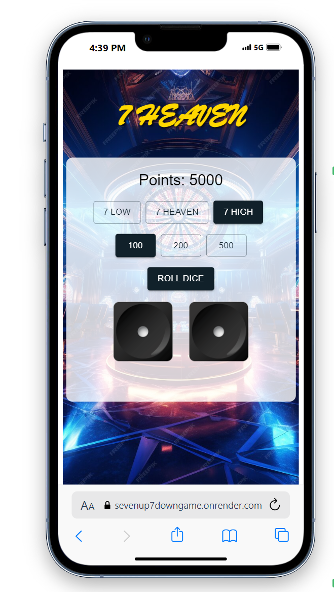

# Casino Dice Game * 7 Heaven *

## Demo Link

[Live Demo](https://sevenup7downgame.onrender.com)

## Images
*Add images of the project here.*
IMAGE:1 

Welcome to the Casino Dice Game! This is a simple web-based game where players can roll two dice and place bets on different outcomes. This README provides an overview of the project structure, features of the game, styling details, additional information, and how to replicate the project.

## General Information

This project is built using the following technologies and libraries:

- **Frontend**:
  - React.js: JavaScript library for building user interfaces.
  - Redux: State management library for managing application state.
  - Framer Motion: Animation library for creating smooth animations.
  - Material-UI: Component library for React applications, used for UI components and styling.
  
- **Backend**:
  - Node.js: JavaScript runtime for building server-side applications.
  - Express.js: Web application framework for Node.js, used for building RESTful APIs.
  - MongoDB: NoSQL database for storing game data.

## Folder Structure

### Frontend
- `src/`: Contains the frontend source code.
  - `components/`: React components used in the application.
  - `services/`: Services for making API calls.
  - `redux/`: Redux store setup and reducers.
  - `assets/`: Images and other static assets.
  - `App.js`: Main application component.
  - `index.js`: Entry point of the application.
  - `GamePage.jsx`: Main game page component.
  - `BetAmount.jsx`: Component for selecting bet amounts.
  - `BetOptions.jsx`: Component for selecting bet options.
  - `Dice.jsx`: Component for dice rolling animation.
  - `PlayerPoints.jsx`: Component for displaying player points.
  - `RollDiceButton.jsx`: Component for rolling the dice.

### Backend
- `server/`: Contains the backend source code.
  - `models/`: Data models for the game.
  - `routes/`: API routes for handling game actions.
  - `services/`: Services for game logic.
  - `app.js`: Express application setup.
  - `server.js`: Entry point of the backend server.
  - `db.js`: Database connection setup.

## Redux Store

The Redux store is used to manage the state of the game. It includes reducers for managing points, bet amount, bet type, dice result, loading state, and more.

## Features of the Game

- Players can roll two dice and place bets on different outcomes.
- Bets can be placed on specific numbers, ranges, or combinations.
- The game calculates the result based on the sum of the two dice and updates the player's points accordingly.
- Win or lose messages are displayed based on the outcome of the roll.
- The game includes animations for dice rolling and displays the result with smooth transitions.

## Styling CSS for Mobile Viewports

The game's CSS is optimized for mobile viewports to provide a seamless gaming experience on various devices. It includes responsive design principles to ensure proper layout and styling across different screen sizes.

## Animation of Dice

The dice rolling animation is achieved using the Framer Motion library. When the roll dice button is clicked, the dice images rotate randomly for a specified duration to simulate rolling. After the animation completes, the actual result is displayed.

## Components of Material UI Used

- **Button**: Used for bet amount selection and rolling the dice.
- **Box**: Used for layout and spacing of components.
- **Typography**: Used for displaying text elements.
- **CSSBaseline**: Used for resetting browser styles and ensuring consistent styling across different browsers.

## Additional Information

- This project is deployed on the Render platform for live testing and demonstration purposes.
- For any issues or suggestions, please feel free to open an issue or submit a pull request on GitHub.

## How to Replicate

To replicate the project, follow these steps:

1. Clone the repository to your local machine.
2. Navigate to the `frontend` directory and run `npm install` to install dependencies.
3. Repeat step 2 for the `backend` directory.
4. Set up a MongoDB database and configure the connection in the backend (`server/db.js`).
5. Run the backend server using `npm start` in the `backend` directory.
6. Run the frontend application using `npm start` in the `frontend` directory.
7. Access the application in your web browser at `http://localhost:3000`.
8. Start playing the Casino Dice Game!

Thank you for your interest in the Casino Dice Game! We hope you enjoy playing it. If you have any questions or need further assistance, please don't hesitate to reach out.